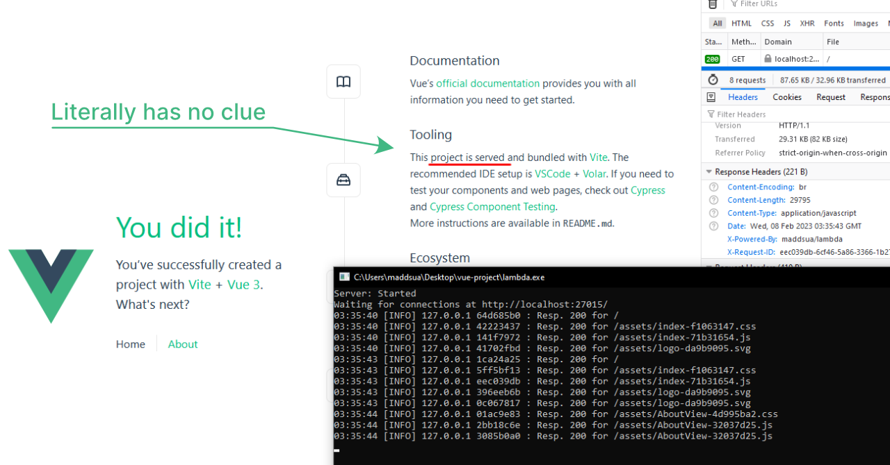

# A request-isolating multi thread HTTP/1.1 web server framework

\* At the moment lambda uses M$ Windows implementation of sockets, so in order to build it for Linux you will need to do some work replacing them. I'll probably do it myself in the future, but for not it is what it is.

### What?

The idea behind this project is to bring the simplicity of building serverless backends with AWS Lambda to your C++ projects. Define a callback function, start a server and watch things just work.

### Why?

OK, I just needed to have http server functionality and serial port communications in the same app. I tried doing that with NodeJS with results that did not satisfy me. Unfortunally, Deno didn't have Web Serial API implemented just yet and all the libs that claim to bring it are, IMHO, garbage.

But it does not end on COM ports. It's C++, now you have all the power possible 😎👍

### Why not any other C++ server library?

Have you ever seen their code structure? It was easier for me to build a web server from scratch, than to find out how their monstrosity works. Well, you can tell that I've done exactly that.

<br>

**Here, a Vue project is being served by lambda for no reason at all**



<br>

# How is it similar to AWS Lambda?

Take a look at these two code snippets:

<br>

Netlify Functions (AWS Lambda under the hood) goes first:

```
import { Handler, HandlerEvent, HandlerContext } from "@netlify/functions";

const handler: Handler = async (event: HandlerEvent, context: HandlerContext) => {
  return {
    statusCode: 200,
    headers: {
      "x-maddsua": "test"
    },
    body: JSON.stringify({ message: "Hello World" }),
  };
};

export { handler };
```
<br>

And here goes my lambda (C++):

```
#include "include/maddsua/lambda.hpp"
#include <nlohmann/json.hpp>
using JSON = nlohmann::json;

lambda::Response requesthandeler(lambda::Event event) {
    return {
        200,    //    status code
        {       //    headers
          { "x-maddsua", "test" }
        },
                //    body
        JSON({ {"message", "Hello World"} }).dump()
    };
}
```

<br>

The main function is not included (obviously) as long as AWS'es backend stuff that actually runs their Lambda.

See [demo code](./main.cpp) for more. It will make sence, I promise.

## Building a server app with the lambda

1. Include `lambda.hpp`
2. Create a callback function and a lambda instance, as in the [example](main.cpp)
3. Link to lambda.dll and compile the project
4. Run it. Everything should run smoooothly

### [See how to do that in detail](main.cpp)

## Requirements for running the app that uses prebuild lambda.dll

- Windows 7+
- [Universal C Runtime (URCT)](https://support.microsoft.com/en-us/topic/update-for-universal-c-runtime-in-windows-c0514201-7fe6-95a3-b0a5-287930f3560c)

## Requirements for building the lib

- M$ Windows build of [GCC 9+](https://packages.msys2.org/base/mingw-w64-gcc) ( I use GCC 12 by the way )
- [JSON for Modern C++](https://github.com/nlohmann/json)
- `make` utility to make stuff. Get it?
- Brotli compression library. A static library or a dll, header files are needed too
- Zlib, the same as with Brotli
- Sockets:
    - For Windows bois: don't forget to include `lambda.hpp` before the `windows.h` in your project's main, or winsock will freak out
    - For Linux bois: replace Windows sockets with non-M$ ones. Sorry, but I still didn't do that =(

## Notes

### WSA

When not using lambda server, before calling `fetch()` make sure that windows sockets are initialized. Check that by invoking `socketsReady()` - true indicates that you are good to go. If not, call `WSAStartup()` yourself and hope for best 😈.

Seriously, it would be a better idea to use curl or something similar for the http CLIENT things, in case you don't need the SERVER.

### Mutlipe instances

If creating mutlipe instances of lambda be sure to init all of them with config property `mutlipeInstances` set to `true`.
