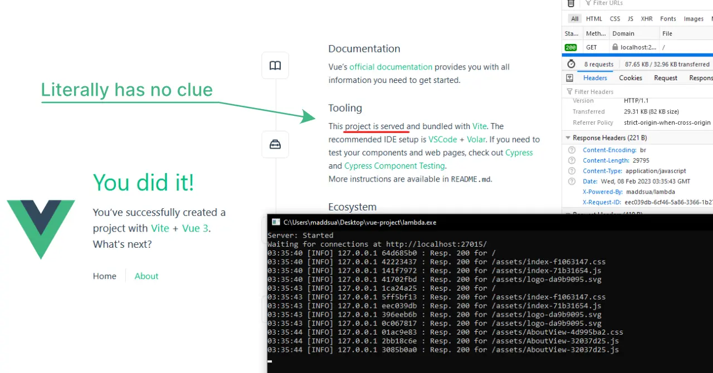
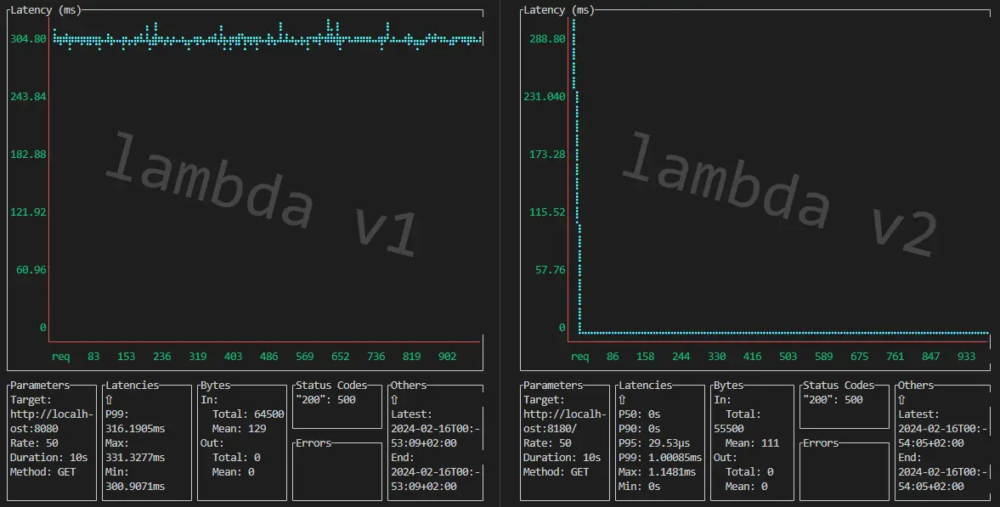
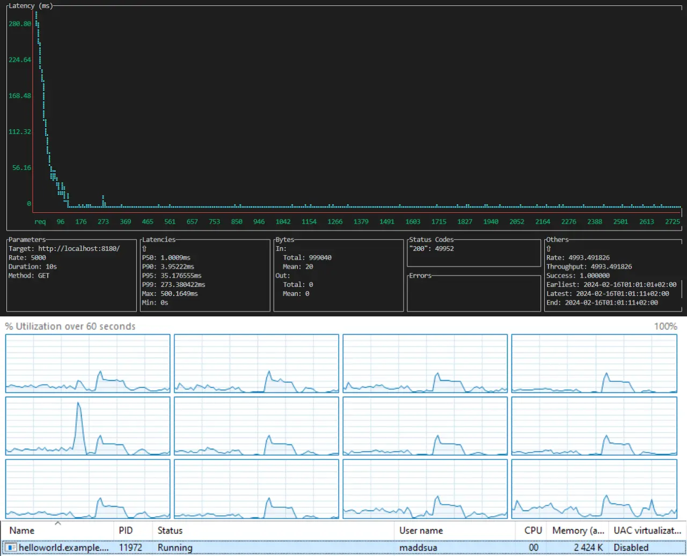

# lambda

(also maddsua/lambda, lambda++)

## A definitely not a NodeJS-based API server framework

Lambda provides a platform to create API servers in C++ fast.
A basic "hello world" is just as small and simple as if you were using expressJS or any other JS library:

```c++
#include <maddsua/lambda.hpp>
using namespace Lambda;

const auto requestHandler = [](const Request& req, const Context& context) {
   return Response("<h1>Hello World!<h1>");
};

int main(int argc, char const *argv[]) {
   auto server = LambdaInstance(requestHandler, {});
   server.awaitFinished();
   return 0;
}
```

### So what lambda is:
- Internal API server
- Client facing API server (if you feel lucky)
- App server
- Dev server of any kind
- Web server (with some quirks, some say it's cute)

### What lambda is not:
- Nginx killer
- Reverse proxy
- Load balancer (please don't use it for that)
- Email server (God forbid)

<br />



**Here, a Vue project is being served by lambda for no reason at all**


## Features

- Full http/1.1 support
- Request/Response based API (just like in Cloudflare Workers)
- Server Side Events support
- Websocket server built in
- Fully asynchronous connection handling
- Thread-safe logging
- Fast port reuse support (like if it's a big thing lol)
- HTTP response compression (Brotli, Gzip, Deflate)
- Configurable error pages
- Request ID tracking
- Custom JSON server/parsed implementation (it's pretty good actually)
- Polyfills for strings and Date object (more to be added)


## Performace 



I was able to push it all the way up to 25k rps but it's not stable at all at that rate.

Removing the task join list would help smooth that graph, but it's not what you wan't for memory safety.
Although, if you are not planning to destroy a lambda instance (if you only create it once in program lifetime), you may want to disable the task join list.

**A latency comparison between v1 and v2** (50 rps, 10s)

Now let's get a bit crazy and crank it up to 5000 rps. At this point v1 just died, and v2 didn't even feel it:



## Error handling/exceptions

lambda uses std::exception-derived objects to handle errors so get ready to catch some.
But even if you don't, it's unlikely that a program would just be terminated as any handler
errors will be caught automatically and a default error page would be returned to the client.


## Building a server app with lambda

I'm using GCC 12 here, you should be fine with any other version that supports C++ 20
but don't expect it to work with MSVC without doing a shaman dance first.

### Dependencies

- brotli (v1.1.0)
- zlib (v1.2.13)

That's it. Just make sure they both installed and you're golden.

### Linking

You can link lambda both as a dll (shared object) or a static (.a) library.
Both ways should be fine. In case you need a dll import object (.dll.a) it's generated too when building the `libshared` target.

When on Windows, don't forget to link with winsock2 (add `-lws2_32`) or it will bite you in the ass.

### Compiling your project

Link `lambda.dll` and you're good to go. Oh, don't forget to include some headers, obviously.

Go see [some examples or smthng](/examples)


## A few quick notes before you start blasting

### OS support

- Any modern linux
- Windows 7+ (might actually work on 7, let me know if it does)

### Compiler version

Use GCC 10 or never. The project uses a few of the c++20 features, and it might not compile with GCC's older versions.

Other compilers are not \*officially\* supported, but there aren't any super-GCC-specific tricks employed in this project, so theoretically with some tweaking it should compile anywhere.
